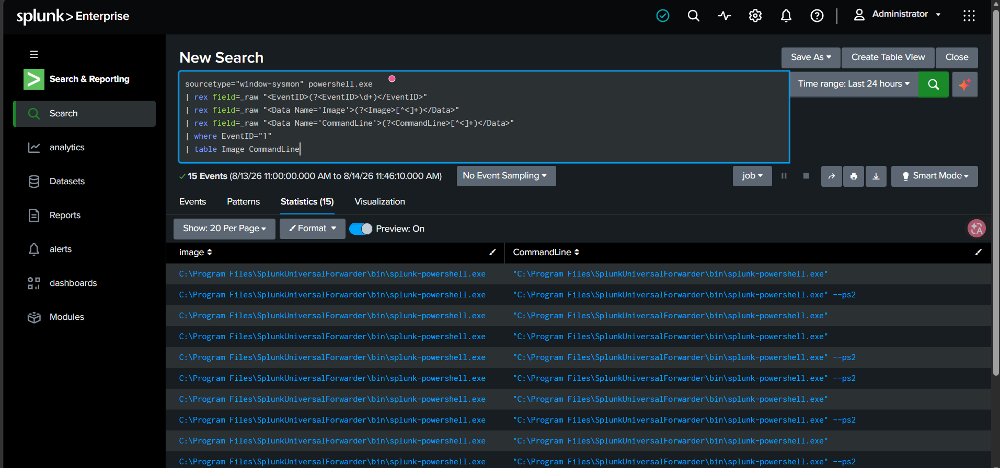
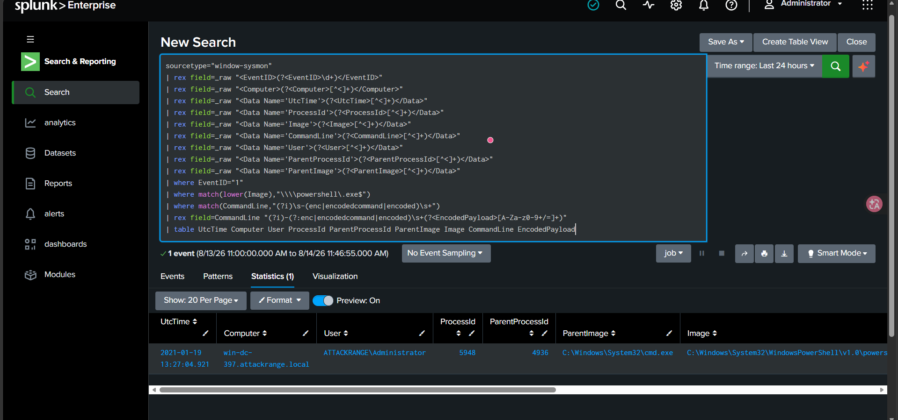

# D01 - Encoded PowerShell Execution

## Objective

Detect Windows PowerShell processes executed with an encoded command argument and document the investigation workflow.

## MITRE ATT&CK

- **Technique:** T1059.001
- **Name:** PowerShell
- **Tactic:** Execution

## Data Source

- Sysmon
- Event ID 1 - Process Creation
- Splunk sourcetype: `window-sysmon`

## Detection Development

### Version 1 - Broad Search

The first search looked for Sysmon process creation events containing `powershell.exe`.

```spl
sourcetype="window-sysmon" powershell.exe
| rex field=_raw "<EventID>(?<EventID>\d+)</EventID>"
| rex field=_raw "<Data Name='Image'>(?<Image>[^<]+)</Data>"
| rex field=_raw "<Data Name='CommandLine'>(?<CommandLine>[^<]+)</Data>"
| where EventID="1"
| table Image CommandLine
```

This returned **15 events**.

Most results were:

```text
C:\Program Files\SplunkUniversalForwarder\bin\splunk-powershell.exe
```

These events are Splunk Universal Forwarder activity and are not the Windows PowerShell execution we wanted to detect.

This is a useful example of why a broad keyword search may generate noise.

### Version 2 - Tuned Detection

The second version was tuned to:

- Match Sysmon Event ID 1.
- Require the executable image to end in `powershell.exe`.
- Require an encoded-command switch such as `-enc`, `-encoded`, or `-encodedcommand`.
- Extract the Base64 payload into a separate field.

```spl
sourcetype="window-sysmon"
| rex field=_raw "<EventID>(?<EventID>\d+)</EventID>"
| rex field=_raw "<Computer>(?<Computer>[^<]+)</Computer>"
| rex field=_raw "<Data Name='UtcTime'>(?<UtcTime>[^<]+)</Data>"
| rex field=_raw "<Data Name='ProcessId'>(?<ProcessId>[^<]+)</Data>"
| rex field=_raw "<Data Name='Image'>(?<Image>[^<]+)</Data>"
| rex field=_raw "<Data Name='CommandLine'>(?<CommandLine>[^<]+)</Data>"
| rex field=_raw "<Data Name='User'>(?<User>[^<]+)</Data>"
| rex field=_raw "<Data Name='ParentProcessId'>(?<ParentProcessId>[^<]+)</Data>"
| rex field=_raw "<Data Name='ParentImage'>(?<ParentImage>[^<]+)</Data>"
| where EventID="1"
| where match(lower(Image),"\\\\powershell\.exe$")
| where match(CommandLine,"(?i)\s-(enc|encodedcommand|encoded)\s+")
| rex field=CommandLine "(?i)-(?:enc|encodedcommand|encoded)\s+(?<EncodedPayload>[A-Za-z0-9+/=]+)"
| table UtcTime Computer User ProcessId ParentProcessId ParentImage Image CommandLine EncodedPayload
```

The tuned detection returned **1 event**.

## Detection Result

| Field | Value |
|---|---|
| UtcTime | `2021-01-19 13:27:04.921` |
| Computer | `win-dc-397.attackrange.local` |
| User | `ATTACKRANGE\Administrator` |
| ProcessId | `5948` |
| ParentProcessId | `4936` |
| ParentImage | `C:\Windows\System32\cmd.exe` |
| Image | `C:\Windows\System32\WindowsPowerShell\v1.0\powershell.exe` |

Command line:

```text
powershell.exe -Exec bypass -enc VwByAGkAdABlAC0ASABvAHMAdAAgACIASABlAGwAbABvACAAVwBvAHIAbABkACIA
```

## Payload Analysis

The value after `-enc` is Base64 encoded.

PowerShell `EncodedCommand` payloads are UTF-16LE text.

Decoded payload:

```powershell
Write-Host "Hello World"
```

The encoded payload itself is benign. The detection therefore identifies the **use of encoded PowerShell**, which is suspicious and worth investigation, but does not by itself prove malicious activity.

## Child Process Investigation

The PowerShell process had PID `5948`.

A follow-up search was used to identify processes spawned by this PowerShell instance:

```spl
sourcetype="window-sysmon"
| rex field=_raw "<EventID>(?<EventID>\d+)</EventID>"
| rex field=_raw "<Data Name='UtcTime'>(?<UtcTime>[^<]+)</Data>"
| rex field=_raw "<Data Name='ProcessId'>(?<ProcessId>[^<]+)</Data>"
| rex field=_raw "<Data Name='ParentProcessId'>(?<ParentProcessId>[^<]+)</Data>"
| rex field=_raw "<Data Name='Image'>(?<Image>[^<]+)</Data>"
| rex field=_raw "<Data Name='CommandLine'>(?<CommandLine>[^<]+)</Data>"
| where EventID="1"
| where ParentProcessId="5948"
| table UtcTime ProcessId ParentProcessId Image CommandLine
```

Result:

```text
No events
```

No child process was observed for PID `5948`.

This is consistent with the decoded payload because `Write-Host "Hello World"` only prints text and does not need to spawn another process.

## Assessment

### What was suspicious?

- Windows PowerShell was executed with `-Exec bypass`.
- The command used `-enc`, hiding the plaintext PowerShell command from immediate command-line inspection.
- The parent process was `cmd.exe`.

### What reduced the severity?

- The encoded payload decoded to a harmless `Write-Host "Hello World"` command.
- No child processes were observed from the PowerShell process.

### Verdict

**Suspicious execution technique observed, but the investigated payload is benign.**

This should be treated as a detection signal that requires investigation rather than an automatic confirmation of malicious activity.

## False Positives

Potential legitimate sources include:

- System administrators.
- Automation scripts.
- Deployment tools.
- Security testing tools.
- Internal IT maintenance.

The initial broad query also matched Splunk Universal Forwarder's `splunk-powershell.exe`, demonstrating the need for process-path and command-line tuning.

## Analyst Investigation Checklist

When this detection triggers, analysts should review:

- Parent process.
- User account.
- Decoded PowerShell payload.
- Child processes.
- Network connections around the same timestamp.
- File creation or modification activity.
- Other suspicious activity on the same host.
- Whether the command was expected administrative activity.

## Evidence

### V1 - Broad Search



### V2 - Tuned Detection



## Files

- `detection-v1.spl` - initial broad search.
- `detection-v2.spl` - tuned encoded PowerShell detection.
- `child-process-check.spl` - follow-up child-process investigation query.
- `investigation.md` - investigation notes.
